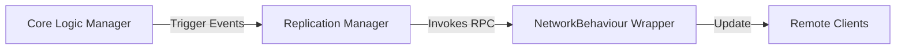

# Networking Strategy

The project utilizes **Unity Netcode for GameObjects (NGO)** as its primary networking framework. The architecture is designed to be **Server-Authoritative** while allowing for responsive client-side interactions through prediction.

## 🏗️ General Communication Pattern

To maintain modularity, networking logic is decoupled from the core domain logic using **Replication Managers**.

1.  **Core Manager**: Contains the game logic and state (e.g., `InventoryManager`).
2.  **Replication Manager Interface**: Defines the contract for network synchronization (e.g., `IInventoryReplicationManager`).
3.  **NetworkBehaviour Wrapper**: A scene-object component that implements the replication interface and handles the actual `RPC` or `NetworkVariable` calls.

## ⏱️ Synchronization Models

### 1. Attribute Replication
Attributes (Health, Mana, etc.) are synchronized from the Server to Clients.
- **Server**: When an attribute value changes, the `ReplicationManager` invokes an action typically mapped to a `ClientRpc`.
- **Client**: Updates its local `AttributeSetManager` value to match the server's state, triggering UI updates.

### 2. Client-Side Prediction
For high-responsiveness, the project supports prediction via **Prediction Keys**.
- **Movement & Abilities**: Clients execute logic immediately and send a timestamped request to the server.
- **Reconciliation**: The server executes the same logic and sends a confirmation/correction back. If a correction is sent, the client "snaps" to the server's state.

### 3. Gameplay Cues
Cues are replicated globally. This ensures that visual effects (explosions, flashes) and sounds are synchronized across all clients for a consistent experience.

## 📦 Inventory & Equipment Sync

Inventory state is synchronized as separate delta updates rather than the entire list.
- **NotifyClientAddItem**: Called on the server when a player picks up an item; triggers a local add on the target client.
- **NotifyClientRemoveItem**: Ensures that consumed resources (e.g., used for upgrades) are removed from the client's local view immediately after server validation.

## 🛡️ Security & Validation
All state-modifying requests (Granting items, Activating abilities) follow a **Request-Validation-Execution** flow:
1. Client sends a `ServerRpc` request.
2. Server validates the request (e.g., "Does the player have enough Mana?").
3. If valid, the Server executes the logic and replicates the result back to all relevant clients.

---
[Back to Overview](../Overview.md) | [Ability System](../Systems/Ability_System.md) | [UI Architecture](../UI/Architecture.md)
