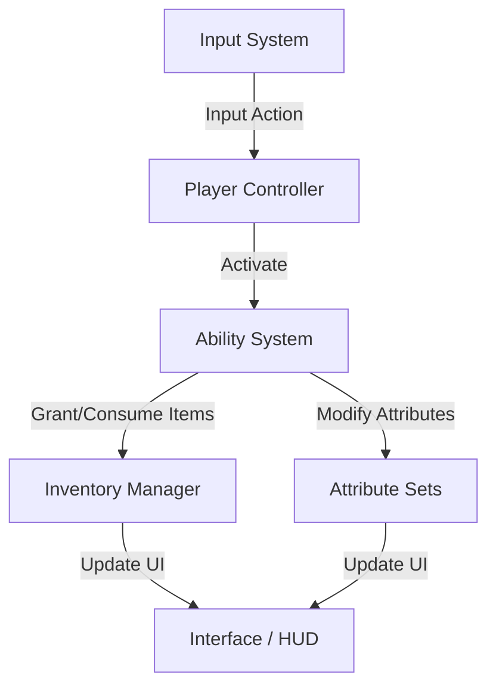

# Project Architecture Overview

This document provides a high-level overview of the architectural design, directory structure, and core philosophies of the project.

## 🏗️ Architectural Philosophy: Core vs. Extensions

The project follows a strict **modular architecture** designed to separate reusable domain logic from game-specific implementation.

1.  **Core Systems (`Assets/Systems`)**: 
    - Contain the foundational rules, engine-agnostic (where possible) logic, and base classes.
    - Designed to be independent packages that could eventually be moved to `Plugins/`.
    - Examples: `AbilitySystem`, `ItemSystem`, `AISystem`.

2.  **Systems Extensions (`Assets/SystemsExtensions`)**:
    - Contain implementations and specializations specific to **this** game.
    - Extends core systems through inheritance or partial classes.
    - Examples: `AbilitySystemExtension` (specific abilities), `AvatarSlots` (game-specific equipment slots).

## 📂 Directory Structure Map

| Directory | Purpose |
| :--- | :--- |
| `Assets/Systems/Audio` | High-performance, jobified sound raytracing, occlusion, and environmental reverb. |
| `Assets/Systems/AbilitySystem` | The core Gameplay Ability System (GAS). |
| `Assets/Systems/AbilityGraph` | Visual node-based engine for creating and executing abilities. |
| `Assets/AISystem` | Modular AI framework based on Sensors, Goals, and Actions. |
| `Assets/Systems/Item` | Foundation for items and inventories. |
| `Assets/Systems/Equipment` | Logic for equipping items and managing stats. |
| `Assets/Systems/Animation` | Abstraction layer for Unity Animator state control. |
| `Assets/Systems/Core` | Bootstrapping, scene management, and singleton patterns. |
| `Assets/Gameplay` | High-level game rules, controllers, and lobby logic. |
| `Assets/Interface` | UI Toolkit assets (UXML, USS) and C# Controllers. |
| `Assets/SystemsExtensions` | Game-specific implementations (e.g., "Player" ability). |
| `Assets/Systems/EternityCommon` | Common and editor utilities. |
| `Assets/Systems/GameplayModifier` | System for modifying gameplay rules. |
| `Assets/Systems/GameplayTags` | Hierarchical tagging system for logic and identification. |
| `Assets/Systems/ScalableFloat` | Data-driven mathematical scaling for designer values. |
| `Assets/Localisation` | Multi-language support for UI and game data. |

## 🛠️ Key Technologies

- **UI Toolkit**: Preferred for all modern interfaces (Main Menu, HUD, Settings). Uses a semi-MVC pattern.
- **Netcode for GameObjects (NGO)**: Used for state synchronization and RPCs.
- **Gameplay Ability System (GAS)**: A custom-built, tag-driven system for abilities, effects, and attributes.
- **ScriptableObjects**: Extensively used for "Definitions" (Item definitions, Ability definitions) to ensure a data-driven workflow.
- **Jobified Attribute System**: A high-performance recalculation pipeline using Burst and the Job System to handle 100+ entities with minimal frame impact.

## 🔄 Core Workflows

---
[Ability System](./Systems/Ability_System.md) | [Item System](./Systems/Item_System.md) | [AI Architecture](./Systems/AI_Architecture.md) | [UI Architecture](./UI/Architecture.md)
[Interaction & Camera](./Systems/Interaction_and_Camera.md) | [Animation & Visuals](./Systems/Animation_and_Visuals.md) | [Assets & Localization](./Systems/Asset_and_Localization.md) | [Utilities Reference](./Systems/Utilities_Reference.md) | [Sound Raytracing](./Systems/Sound_Raytracing.md)
