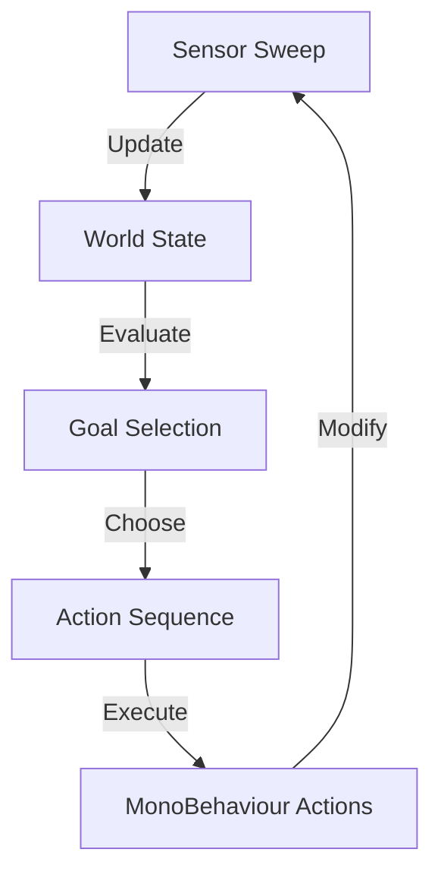

# AI Architecture

The project features a modular AI framework designed for flexible agent behavior through a sensor-goal-action pipeline.

## 🧠 Core Methodology

The AI logic is decoupled into distinct layers that allow for sophisticated decision-making based on the current state of the world.

### 1. Sensors (`Sensors`)
Sensors are responsible for gathering data from the environment and populating the agent's **World State**.
- **Examples**: Vision sensors for detecting enemies, proximity sensors for threat detection.

### 2. Goals (`Goals`)
Goals represent the "desires" of the AI agent. Each goal has a priority and a set of required conditions.
- **`IdleGoal`**: The default fallback goal.
- **Priority Logic**: The system evaluates all active goals and selects the one with the highest current relevance.

### 3. Actions (`Actions`)
Actions are the discrete tasks the AI can perform to satisfy a goal.
- **Waitable Actions**: Actions can be asynchronous, allowing the AI to "Wait" (e.g., `IdleAction` waiting for a timer) before completing.
- **Action Requirements**: Actions define what world state they modify, allowing for future planning (GOAP-like) implementations.

### 4. Decision Makers (`DecisionMakers`)
The `DefaultAgentDecisionMaker` acts as the brain. It evaluates the current sensors, selects the most relevant goal, and executes the sequence of actions necessary to achieve it.

## 🔄 AI Execution Loop

## 🛠️ Agents and Capabilities
- **`AgentTypes`**: Define the specific characteristics and movement parameters of an AI entity.
- **`Capabilities`**: Modular logic components that define what an agent is "capable" of doing (e.g., `CombatCapability`, `MovementCapability`).

---
[Back to Overview](../Overview.md) | [Ability System](./Ability_System.md)
