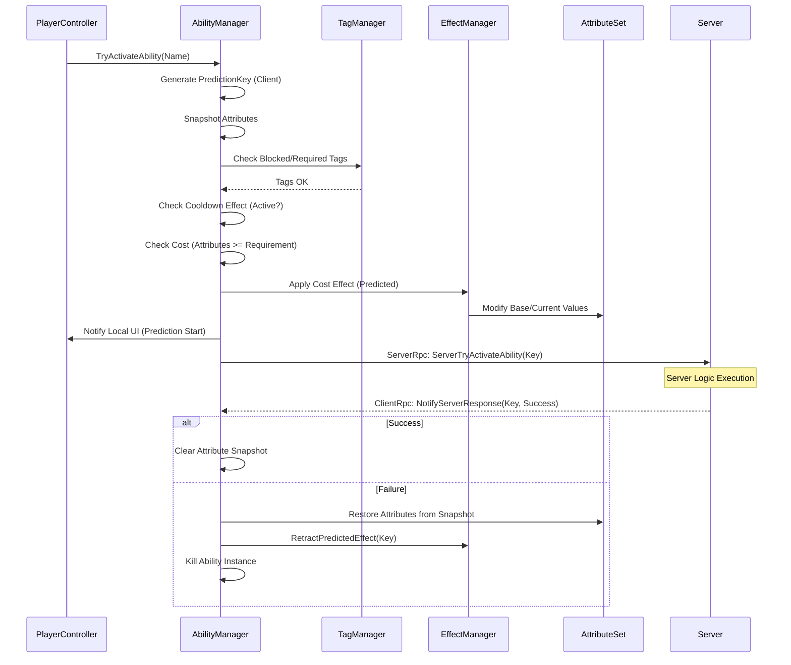

# Ability System Architecture (Advanced Reference)

This document provides a highly technical deep-dive into the internal mechanics of the project's Gameplay Ability System (GAS).

---

## 🏛️ Central Hub: The Managers

The system is orchestrated by the **`AbilitySystemManager`**, which implements `IAbilitySystem` and coordinates between several specialized sub-managers:

### 1. Ability System Manager (`AbilitySystemManager`)
- **`AbilityManager`**: Manages the granting, removal, and lifecycle of active ability instances.
- **`EffectManager`**: Handles the application, ticking, and stacking of persistent `GameplayEffects`.
- **`AttributeSetManager`**: The global container for all `AttributeSets`. It handles attribute lookup, event dispatching, state snapshotting, and orchestrates the **Jobified Attribute Recalculation** pipeline.
- **`TagManager`**: Tracks active gameplay tags on the actor for blocking and requirements.
- **`AbilityGraph` Integration**: Provides a visual node-based engine for creating complex ability logic. It uses a `GraphRunner` to execute nodes and supports `WaitableNode` for asynchronous gameplay logic. See the [AbilityGraph Node Reference](./AbilityGraph_Nodes.md) for a full list of available nodes.
- **`CueManager`**: Manages the dispatch and lifecycle of visual and audio feedback (Cues).

---

## 📊 Attributes & The Aggregator

Attributes (e.g., Health, AttackPower) are complex objects managed by the **`AttributeAggregator`**, which handles multiple overlapping modifiers and groups them into logical sets.

### 1. Attribute Sets (`AttributeSet`)
Attributes are logically grouped into **Attribute Sets** (e.g., `BaseStatsSet`, `CombatSet`).
- **Grouping**: Allows developers to categorize stats and keep the system modular.
- **Auto-Initialization**: The base `AttributeSet` class uses reflection to detect and automatically instantiate any `Attribute` properties or fields defined in its subclasses.
- **Reset**: Every set provides a `Reset()` method to return attributes to their starting values (crucial for match restarts).

### 2. Attribute State (`AttributeValue`)
Each individual attribute maintains a stateful `AttributeValue` struct containing:
- **BaseValue**: The "permanent" value (e.g., base HP from level).
- **CurrentValue**: The "calculated" value after applying all active modifiers.
- **MinValue / MaxValue**: Defined bounds for the attribute.
- **Clamping**: The system automatically enforces bounds ensuring that both `BaseValue` and `CurrentValue` never exceed the defined Min/Max range (crucial for resources like Health or Mana).

### 3. Jobified Recalculation & Formula
Attributes are recalculated using a high-performance **`AttributeRecalculationJob`** (Burst-compiled). This system processes all attributes and modifiers in parallel, providing a 10-20x performance boost over legacy methods.

**Formula:**
`CurrentValue = (BaseValue + Sum(AdditiveModifiers)) * Product(MultiplicativeModifiers)`

**Special Cases:**
- **Override**: If any `Override` modifier is active, it completely replaces the calculation.
- **Lazy Sync**: If an attribute is read while the system is "dirty", it triggers an immediate synchronous update to ensure deterministic results.

For a deep dive into the performance and architecture, see the **[Jobified Attribute System Documentation](./Jobified_Attributes.md)**.

### 4. Dynamic Dependencies
Modifiers can be marked as `IDynamicDependency`. This allows a modifier's magnitude to change in real-time based on *other* attributes (e.g., "Gain 1% Attack Power for every 100 missing Health").

### 5. Attribute Listeners & Events
The `Attribute` class provides powerful hooks for game logic:
- **OnAttribute[Base/Current]ValuePreChange**: A `Func` that allows modifying a value *before* it is applied (e.g., clamping HP to 1 if "Undying" buff is active).
- **OnAttribute[Base/Current]ValueChanged**: An `Action` triggered *after* the value is committed, used for UI updates or triggering "Death" logic.

---

## 🛠️ Modifier Types & Examples

Modifiers determine the **magnitude** of an effect. The system provides several ways to calculate these values.

### 1. Scalable Float (`FloatModifier`)
Uses a fixed value that can scale with the effect's level (e.g., via a Curve or Linear scale).
*   **Best for**: Hardcoded values that don't depend on external stats.
*   **Example**: A "Minor Healing Potion" that always restores `20 + (5 * Level)` HP.

### 2. Attribute Based (`AttributeBasedModifier`)
Calculates magnitude based on the value of *another* attribute on either the **Source** or the **Target**.
*   **Capture Types**:
    *   **SnapshotOnCreation**: Captures the attribute value once when the effect is created. Changes to the attribute later won't affect this instance.
    *   **OnApplication**: Uses the live attribute value whenever the effect is calculated, but doesn't trigger a recalculation on its own.
    *   **Dynamic**: Uses the live value AND automatically triggers an effect recalculation if the underlying attribute changes.
*   **Example**: 
    *   **Snapshot**: A "Bleed" that deals damage based on the target's HP *at the moment they were hit*.
    *   **Dynamic**: A "Berserker" buff that grants `AttackPower` based on your `MissingHealth`. As your HP drops, your Attack Power increases in real-time.

### 3. Set By Caller (`SetByCallerModifier`)
Allows the "Caller" (the Ability, projectile, or script) to pass a dynamic value to the effect at runtime using a **Gameplay Tag** as a key.
*   **Best for**: Decoupling effect logic from ability logic.
*   **Example**: A "Charged Shot" ability.
    1.  The player holds the button for `X` seconds.
    2.  The Ability script calculates `Damage = Base * X`.
    3.  The Ability calls `effect.SetSetByCallerMagnitude(Data.Damage, Damage)`.
    4.  The system uses this specific `Damage` value for that one application.

---

## 🧪 Gameplay Effect Lifecycle: Deep Dive

Gameplay Effects (GEs) are the primary vehicle for all state changes.

### 1. Application Validation
Before an effect is applied, the `EffectManager` performs a multi-stage validation:
1. **Immunity Check**: Checks if the target has any `ApplicationImmunityTags` that match the effect's asset tags.
2. **Requirement Check**: Verifies the target possesses all `ApplicationRequiredTags`.
3. **Custom Application Requirements**: Iterates through any custom `EffectApplicationRequirement` scriptable objects to validate complex scripts (e.g. "Target must have >50% HP").
4. **Removal Logic**: If the effect has `RemoveGameplayEffectsWithTags`, it immediately terminates all existing effects on the target that match the tags.

### 2. Ongoing State Evaluation
Effects can be "Suspended" without being removed. If an effect has `OngoingRequiredTags`, the system constantly monitors the owner's tag state. If requirements are lost, the effect's `IsActive` flag is set to false, pausing its modifiers until requirements are met again.

### 3. Stacking Models
Stacking is defined in the `EffectStack` configuration:
- **AggregateByTarget**: A single instance of the effect exists; new applications increment the `NumStacks` counter.
- **AggregateBySource**: Multiple instances can exist if they come from different sources (e.g., two different players applying the same debuff).
- **Expiration Policies**: Can be set to `ClearEntireStack` or `RemoveSingleStackAndRefreshDuration`.

---

## 🌐 Network Prediction & Reconciliation

The project uses a **Snapshot-and-Rollback** model for high-responsiveness on clients.

### 1. The Prediction Key
Every predicted action is assigned a **`PredictionKey`**.
- **Valid (Predicted)**: Key is generated on the client and sent to the server.
- **Invalid**: Result of server-only or non-predicted actions.

### 2. The Reconciliation Flow
When a client triggers a predicted ability:
1. **Snapshot**: `AbilityManager` takes a full snapshot of all core attributes.
2. **Local Execution**: The client applies effects and modifies attributes immediately.
3. **Server Validation**: The server receives the request + key. It performs the same logic.
4. **The Verdict**: 
    - **Success**: The server confirms the result. The client clears the snapshot.
    - **Failure (Correction)**: The server denies the action. The client performs a **Rollback**:
        - **Restore Attributes**: Attributes are set back to the pre-prediction snapshot.
        - **Effect Retraction**: Any `PredictedEffects` associated with that key are forcefully removed via `RetractPredictedEffect()`.
        - **Ability Termination**: The predicted ability instance is killed.

### 3. Effect Data Synchronization
To ensure consistent results during prediction and server-driven logic, `GameplayEffects` are fully synchronized:
- **`SetByCaller` Magnitudes**: Dynamically applied magnitudes (e.g., from item stats) are reconciled on the client.
- **Level & Stacks**: The server replicates the current effect level and stack count to ensure logic parity.
- **Late-Joiners**: Effects are synced via a catch-up RPC on client connection, including all dynamic magnitudes.

### 4. Ability Network Policies
Abilities support different replication and execution models via the `AbilityNetworkPolicy` enum:
- **`ClientOnly`**: The ability is executed locally on the client only. Used primarily for purely cosmetic or client-side interactions.
- **`ClientPredicted`**: The client executes the ability locally immediately to provide a highly responsive feel, and sends an activation request to the server. The server verifies and either confirms or rolls back the client's state.
- **`Server` (Server-Only)**: The ability runs and executes **exclusively** on the server.
    - **Replication Trust**: Because the ability only runs on the server, the client does *not* execute the ability locally or receive activation/termination RPC requests.
    - Instead, the client trusts the authoritative replication layer to automatically synchronize the resulting active `GameplayEffects`, `GameplayTags`, and `GameplayCues` applied by the server-side ability execution. This prevents duplicate client-side activations and matching replication bugs.

### 5. Ability RPC Batching
For abilities that activate, apply payloads, and terminate rapidly (like hitscan weapons or instant interactions), the networking overhead of separate RPCs can be expensive. 
- The **`ScopedAbilityRPCBatcher`** can be used in a `using` block to intercept calls to the `ReplicationManager`. 
- Upon disposal, it batches `TryActivate`, `TargetData`, and `EndAbility` into a single `AbilityBatchData` struct and dispatches a single RPC to the server, significantly reducing bandwidth.

### 6. Robust Activation Safeguards & Idempotency
To prevent duplicate execution and duplicate effect applications (especially when running as a Host acting as both server and client), the system implements several layers of runtime guards:
- **Initialization Idempotency**: `AbilitySystemComponent.Initialise()` checks if the Ability System has already been created and initialized. If so, it exits early to prevent destroying existing instances and leaving orphaned event bindings.
- **Activation Blockers**: The base class `Ability.CanActivate()` automatically checks `IsActive`. If the ability is already running on the manager, it prevents duplicate concurrent activations and returns `AbilityActivationResult.BlockedByAbility`. Subclasses can customize this by overriding `CanActivate()`.
- **Controller-level Safeguards**: Spawning/initializing systems (such as `AiController`) utilize local execution flags (`_isAscSetup`) to prevent duplicate manual initializations and activation calls in redundant Unity lifecycles (e.g., `OnNetworkSpawn` and `Start`).

---

## 🏷️ Gameplay Cues & Audio-Visual Feedback

Cues are the system's "VFX/SFX" layer. They are triggered by **Gameplay Tags** to remain decoupled from the logic.

### 1. Cue Actions
Cues respond to four primary events via the `CueAction` enum:
- **Play (Invoke)**: One-shot effect (e.g., impact spark).
- **Add**: Persistent visual (e.g., a shield bubble) added when an effect starts.
- **Remove**: Cleans up a persistent visual when an effect expires.
- **Execute**: Immediate logic-driven cue.

### 2. Cue Parameters (`CueData`)
When a cue is triggered, it passes a `CueData` context payload. This supports advanced functionality similar to Epic's GAS `FGameplayCueParameters`, serializing over the network:
- **`Magnitude`**: Useful for scaling visual intensity based on an effect's power.
- **`Normal`**: Surface normal for placing impact decals.
- **`SourceId` / `TargetId`**: References to the involved entities.
- **`VectorData[]`**: Custom arrays for drawing splines or multiple impact points.

### 3. Predictive Handshake
The system uses a **Mark-and-Cull** pattern to handle local prediction:
- **Client**: When a predicted ability triggers a cue, it marks the cue's **PredictionKey** in the `CueManager`.
- **Server**: Replicates the cue back to all clients.
- **Instigating Client**: The `CueManager` checks its sliding-window cache. If a cue with the arriving `PredictionKey` is already marked as predicted, it is culled (double-play prevented). If it arrives without a matching local prediction, it executes normally.

---

## 🎯 Ability Data & Targeted Execution

Abilities often require more than just an activation trigger. The system handles complex payloads through **`AbilityData`** and **`TargetDataHandle`**.

### 1. Polymorphic Targeting (`ITargetData`)
Targeting data is encapsulated in a networked-safe container that supports multiple data types:
- **`TargetDataActor`**: Tracks a specific `NetworkObjectId`.
- **`TargetDataLocation`**: Tracks a 3D coordinate and rotation.
- **`TargetDataHitResult`**: Contains detailed raycast/collision information.

### 2. Payload Serialization
The `TargetDataHandle` implements custom serialization, allowing a client to package targeting results (like a crosshair point) and send them to the server as part of an `AbilityData` payload.

---

## 🔄 Comprehensive Activation Sequence

---
[Back to Overview](../Overview.md) | [Item System](./Item_System.md)
