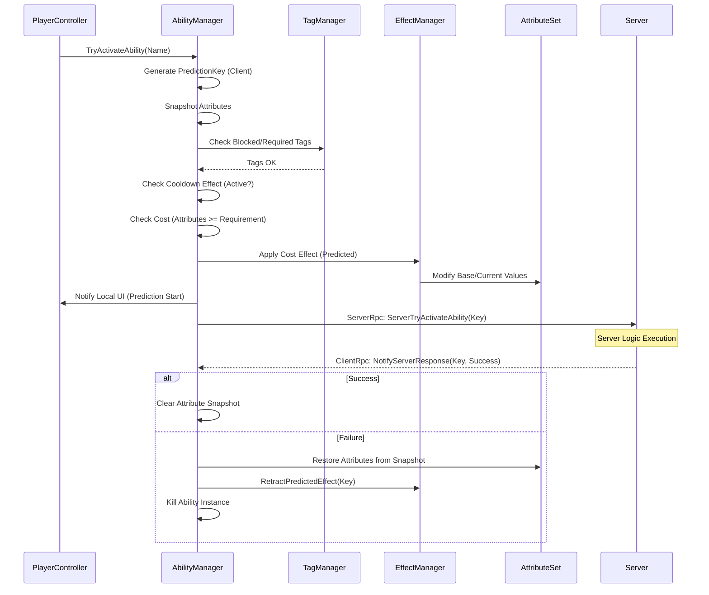

# Ability System Architecture (Advanced Reference)

This document provides a highly technical deep-dive into the internal mechanics of the project's Gameplay Ability System (GAS).

---

## 🏛️ Central Hub: The Managers

The system is orchestrated by the **`AbilitySystemManager`**, which implements `IAbilitySystem` and coordinates between several specialized sub-managers:

### 1. Ability System Manager (`AbilitySystemManager`)
- **`AbilityManager`**: Manages the granting, removal, and lifecycle of active ability instances.
- **`EffectManager`**: Handles the application, ticking, and stacking of persistent `GameplayEffects`.
- **`AttributeSetManager`**: The global container for all `AttributeSets`. It handles attribute lookup, event dispatching, and state snapshotting for network reconciliation.
- **`TagManager`**: Tracks active gameplay tags on the actor for blocking and requirements.
- **`AbilityGraph` Integration**: Provides a visual node-based engine for creating complex ability logic. It uses a `GraphRunner` to execute nodes and supports `WaitableNode` for asynchronous gameplay logic.
- **`CueManager`**: Manages the dispatch and lifecycle of visual and audio feedback (Cues).

---

## 📊 Attributes & The Aggregator

Attributes (e.g., Health, AttackPower) are complex objects managed by the **`AttributeAggregator`**, which handles multiple overlapping modifiers and groups them into logical sets.

### 1. Attribute Sets (`AttributeSet`)
Attributes are logically grouped into **Attribute Sets** (e.g., `BaseStatsSet`, `CombatSet`).
- **Grouping**: Allows developers to categorize stats and keep the system modular.
- **Auto-Initialization**: The base `AttributeSet` class uses reflection to detect and automatically instantiate any `Attribute` properties or fields defined in its subclasses.
- **Reset**: Every set provides a `Reset()` method to return attributes to their starting values (crucial for match restarts).

### 2. Attribute State (`AttributeValue`)
Each individual attribute maintains a stateful `AttributeValue` struct containing:
- **BaseValue**: The "permanent" value (e.g., base HP from level).
- **CurrentValue**: The "calculated" value after applying all active modifiers.
- **MinValue / MaxValue**: Defined bounds for the attribute.
- **Clamping**: The system automatically enforces bounds ensuring that both `BaseValue` and `CurrentValue` never exceed the defined Min/Max range (crucial for resources like Health or Mana).

### 3. Modifiers & Calculation Formula
Modifiers are applied using a strict mathematical priority system in the `AttributeAggregator.CalculateCurrentValue()` method.

**Formula:**
`CurrentValue = (BaseValue + Sum(AdditiveModifiers)) * Product(MultiplicativeModifiers)`

**Special Cases:**
- **Override**: If any `Override` modifier is active, it completely replaces the calculation. If multiple overrides exist, the last one applied wins.
- **Divisive**: Handled as multiplicative inverses (`1 / Magnitude`).
- **Zero-Check**: The system includes an epsilon-based threshold to prevent division by zero during multiplicative calculations.

### 4. Dynamic Dependencies
Modifiers can be marked as `IDynamicDependency`. This allows a modifier's magnitude to change in real-time based on *other* attributes (e.g., "Gain 1% Attack Power for every 100 missing Health").

### 5. Attribute Listeners & Events
The `Attribute` class provides powerful hooks for game logic:
- **OnAttribute[Base/Current]ValuePreChange**: A `Func` that allows modifying a value *before* it is applied (e.g., clamping HP to 1 if "Undying" buff is active).
- **OnAttribute[Base/Current]ValueChanged**: An `Action` triggered *after* the value is committed, used for UI updates or triggering "Death" logic.

---

## 🧪 Gameplay Effect Lifecycle: Deep Dive

Gameplay Effects (GEs) are the primary vehicle for all state changes.

### 1. Application Validation
Before an effect is applied, the `EffectManager` performs a three-stage validation:
1. **Immunity Check**: Checks if the target has any `ApplicationImmunityTags` that match the effect's asset tags.
2. **Requirement Check**: Verifies the target possesses all `ApplicationRequiredTags`.
3. **Removal Logic**: If the effect has `RemoveGameplayEffectsWithTags`, it immediately terminates all existing effects on the target that match the tags.

### 2. Ongoing State Evaluation
Effects can be "Suspended" without being removed. If an effect has `OngoingRequiredTags`, the system constantly monitors the owner's tag state. If requirements are lost, the effect's `IsActive` flag is set to false, pausing its modifiers until requirements are met again.

### 3. Stacking Models
Stacking is defined in the `EffectStack` configuration:
- **AggregateByTarget**: A single instance of the effect exists; new applications increment the `NumStacks` counter.
- **AggregateBySource**: Multiple instances can exist if they come from different sources (e.g., two different players applying the same debuff).
- **Expiration Policies**: Can be set to `ClearEntireStack` or `RemoveSingleStackAndRefreshDuration`.

---

## 🌐 Network Prediction & Reconciliation

The project uses a **Snapshot-and-Rollback** model for high-responsiveness on clients.

### 1. The Prediction Key
Every predicted action is assigned a **`PredictionKey`**.
- **Valid (Predicted)**: Key is generated on the client and sent to the server.
- **Invalid**: Result of server-only or non-predicted actions.

### 2. The Reconciliation Flow
When a client triggers a predicted ability:
1. **Snapshot**: `AbilityManager` takes a full snapshot of all core attributes.
2. **Local Execution**: The client applies effects and modifies attributes immediately.
3. **Server Validation**: The server receives the request + key. It performs the same logic.
4. **The Verdict**: 
    - **Success**: The server confirms the result. The client clears the snapshot.
    - **Failure (Correction)**: The server denies the action. The client performs a **Rollback**:
        - **Restore Attributes**: Attributes are set back to the pre-prediction snapshot.
        - **Effect Retraction**: Any `PredictedEffects` associated with that key are forcefully removed via `RetractPredictedEffect()`.
        - **Ability Termination**: The predicted ability instance is killed.

---

## 🏷️ Gameplay Cues & Audio-Visual Feedback

Cues are the system's "VFX/SFX" layer. They are triggered by **Gameplay Tags** to remain decoupled from the logic.

### 1. Cue Actions
Cues respond to four primary events via the `CueAction` enum:
- **Play (Invoke)**: One-shot effect (e.g., impact spark).
- **Add**: Persistent visual (e.g., a shield bubble) added when an effect starts.
- **Remove**: Cleans up a persistent visual when an effect expires.
- **Execute**: Immediate logic-driven cue.

### 2. Prediction in Cues
The `PlayCue` method accepts a `isPredicted` flag. If true, the client plays the cue immediately. On the server, cues are replicated back to *other* clients but usually suppressed for the instigating client to prevent double-play (Ghosting).

---

## 🔄 Comprehensive Activation Sequence

---
[Back to Overview](../Overview.md) | [Item System](./Item_System.md)
