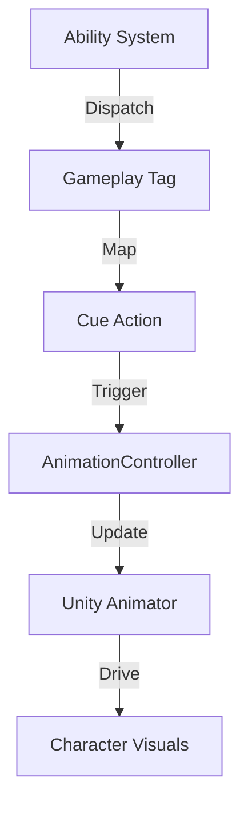

# Animation and Visuals

The project's visual presentation layer is built on a modular system that bridges core gameplay logic (GAS) with visual feedback (Animator).

## 🎬 Animation System

The **`AnimationController`** serves as an abstraction layer for Unity's Mecanim Animator, providing a clean API for character movement and state management.

### 1. Movement Abstraction
The controller simplifies complex Animator parameter management into high-level methods:
- **`SetMovement(x, y)`**: Updates Blend Tree parameters (`MovementX`, `MovementY`) and toggles the `IsMoving` boolean.
- **`StopMovement()`**: Resets all parameters to a stationary state.
- **Smoothing**: The system supports internal damping to prevent jittery transitions during high-frequency input changes.

### 2. Integration with Ability System
Animations are primarily triggered through the **Gameplay Ability System** via **Gameplay Cues**.
- **`PlayCue`**: Ability Tasks and Effects trigger Cues that can invoke specific `Trigger` or `Bool` parameters on the `AnimationController`.
- **Decoupling**: The gameplay logic only cares about the **Gameplay Tag** (e.g., `Cue.Ability.Fire`), while the `CueManager` and `AnimationController` handle the mapping to specific visual assets.

## ✨ Visual Effects & Cues

Visual effects (VFX) follow a similar event-driven pattern.

### 1. Cue Lifecycle
- **Add/Remove**: Used for persistent effects like shield bubbles or damage-over-time "poison" clouds.
- **Execute**: Used for one-shot impact effects (sparks, explosions).

### 2. Network Sync
Visuals are synchronized across the network using the `isPredicted` flag. The local client plays the effect immediately for responsiveness, while the server replicates the event back to other clients to maintain visual consistency.

## 🔄 Animation Flow

---
[Back to Overview](../Overview.md) | [Interaction & Camera](./Interaction_and_Camera.md)
