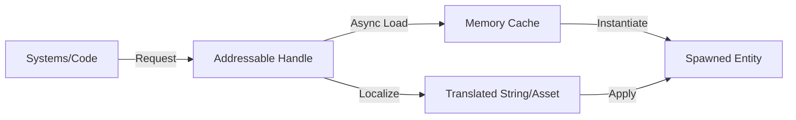

# Asset Management and Localization

This document covers the infrastructure used for managing game assets, asynchronous loading, and multi-language support.

## 📦 Asset Management (Addressables)

The project utilizes Unity's **Addressables** system for modular asset management and memory optimization.

### 1. Asynchronous Loading
Most gameplay assets (Prefabs, Audio, Textures) are loaded on-demand via Addressable Handles.
- **Reference Management**: Systems like the `ItemLibrary` use `AssetReference` types to point to item visuals and UI icons without keeping them permanently in memory.
- **Pre-warming**: Critical assets (like the Main Menu UI) are pre-warmed during the initial splash sequence to ensure zero-latency transitions.

### 2. Prefab Registry
Networking systems (NGO) use a centralized registry of Addressable prefabs to ensure all clients can spawn synchronized entities by their unique Addressable Key.

## 🌍 Localization

Multi-language support is integrated directly into the UI Toolkit and Data-Driven systems.

### 1. Text Localization
- **Localization Settings**: The global project configuration is found in `Assets/Localization Settings.asset`.
- **UI Toolkit Integration**: Labels and tooltips in UXML files use specific localization keys (e.g., `#IDS_MENU_START`) which are translated at runtime based on the user's active locale.

### 2. Data Localization
The system supports localized overrides for data assets (like Item Names and Descriptions). This allows the game to swap out entire `ScriptableObject` fields based on the selected language.

## 🔄 Asset Flow

---
[Back to Overview](../Overview.md) | [Animation & Visuals](./Animation_and_Visuals.md)
