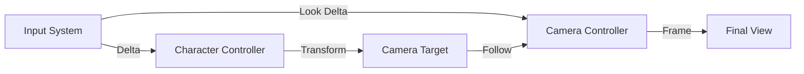

# Interaction and Camera

The project implements a modular camera and interaction system designed to provide a consistent viewing experience while remaining flexible enough for different gameplay contexts.

## 🎥 Camera Architecture

The camera system is built around a "Target and Controller" philosophy, allowing the camera to easily switch focus while maintaining its behavioral logic.

### 1. Camera Controller (`CameraController`)
The main script responsible for the camera's visual state and basic interaction flags.
- **Movement Tracking**: Provides a smooth `isMoving` check to allow other systems (like UI or VFX) to respond to camera motion.
- **Smoothing**: Implements damping for movement and rotation to ensure a "premium" feel.

### 2. Camera Target Controller (`CameraTargetController`)
Handles the "Where" of the camera.
- **Dynamic Targeting**: Allows the camera focus to be swapped at runtime via `SetTarget(Transform)`.
- **Offset Management**: Uses a configurable `offset` vector to ensure the player character remains properly framed during gameplay.

## 🖱️ Input Integration

The camera and character interaction are tightly coupled with the **Input System**.
- **Action Mapping**: Player inputs (Movement, Look, Interaction) are mapped in `DefaultInputActions.inputactions`.
- **Event-Driven**: The camera controllers respond to input events to drive rotation and framing adjustments.

## 🔄 Interaction Flow

## 🛠️ Modular Extensibility
The separation of the `TargetController` from the main `CameraController` allows for:
- **Cinematic Overrides**: Temporarily parenting the camera to a cinematic anchor.
- **Death Cam**: Switching the camera target to a killer or a point of interest upon player death.
- **Spectator Mode**: Easily swapping the target between different players in a multiplayer session.

---
[Back to Overview](../Overview.md) | [AI Architecture](./AI_Architecture.md)
