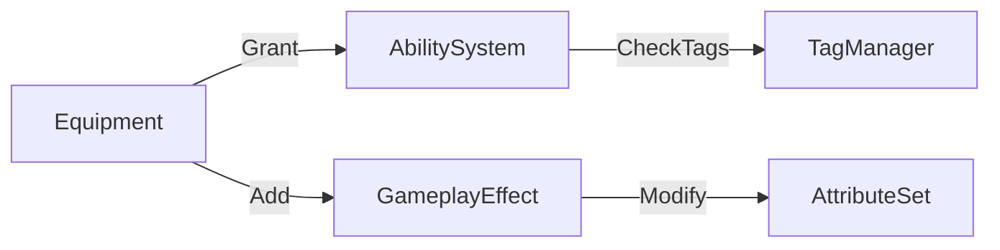

# Item and Equipment Architecture

The project utilizes a data-driven Item System that manages inventory, equipment slots, and item-based progression.

## 📦 Core Components

### 1. Item Definitions (`ItemDefinition`)
All items begin as `ScriptableObject` definitions. They contain static metadata (Name, Icon, Description) and act as factories for runtime objects.
- **`EquipmentDefinition`**: Extends the base definition to include `EquipmentTags`, `EquipmentSlot`, mod slots, and granted abilities/effects.
- **`ModifierDefinition`**: Defines a mod. Carries `OwnedTags` (e.g. `Item.Modifier.Active`/`Passive`) used to match against a slot's `TagQuery`, and `ModifiableEquipmentTags` to gate which equipments can host it.

### Equipment Categories
Three concrete equipment categories are defined as assets under `Assets/Systems/Equipment/Resources/Equipment/`:
- **Energy Core** — `EquipmentSlot.Core`, tag `Item.Equipment.EnergyCore`.
- **Weapon** — `EquipmentSlot.Weapon`, tag `Item.Equipment.Weapon`.
- **Armor** — `EquipmentSlot.Armor`, tag `Item.Equipment.Armor`.

Each category exposes the same mod slot contract: **1 active + 2 passive** (`Mod.Slot.Active.1`, `Mod.Slot.Passive.1`, `Mod.Slot.Passive.2`). The active/passive constraint is enforced by the slot's `TagQuery` matching a mod's `OwnedTags` (e.g., a passive slot only accepts mods carrying `Item.Modifier.Passive`).

### 2. Inventory Management (`InventoryManager`)
A central registry for all items owned by an actor.
- **Storage**: Items are stored as `IBaseItem` contracts.
- **Consumption Logic**: Supports complex requirement checks (e.g., "Do I have 5 Iron and 2 Wood?") through `HasItems` and `ConsumeItems` workflows.
- **Sync**: Uses an `IInventoryReplicationManager` to keep client inventories in sync with the server.

### 3. Equipment Framework (`EquipmentManager`)
Orchestrates the active gear worn by the player.
- **Slot System**: Based on `GameplayTags`. Slots are defined by tags like `Slot.Weapon.Primary` or `Slot.Armor.Chest`.
- **Equip Workflow**: When an item is moved to a slot, the manager instantiates an `Equipment` object and triggers the integration hooks.

## 🔗 System Integration: Items & Abilities

The Item System is tightly coupled with the **Ability System**. This is the project's primary "Power" driver.

- **Granted Abilities**: `Equipment` instances automatically call `AbilityManager.GrantAbility()` when equipped.
- **Granted Effects**: Passive stat boosts (e.g., +10 Strength) are applied as `GameplayEffects` through the owner's `EffectManager`.

## 📈 Item Progression (Upgrades & Mods)

### Upgrades (`IUpgradable`)
Items can be leveled up if the owner possesses the required resources in their `InventoryManager`.
- **Validation**: `CanUpgrade()` checks `InventoryManager.HasItems()`.
- **Execution**: `Upgrade()` consumes resources and increments the item level.

### Modifiers (`IModifiable`)
High-tier equipment supports `Modifier` slots.
- **Modifiers**: Separate assets (`ModifierDefinition`) that provide additional abilities or attribute tweaks.
- **Slot Hardware**: Mod slots are level-gated (`RequiredLevel` on `ModSlot`) — typically the second passive slot is unlocked at a higher equipment level.
- **Type Filtering**: Each `ModSlot` carries a `TagQuery` matched against the mod's `OwnedTags`. A slot tagged for `Item.Modifier.Active` rejects passive mods and vice-versa.
- **Equipment Compatibility**: A mod's `ModifiableEquipmentTags` must intersect the host equipment's `EquipmentTags` — e.g. an EnergyCore-only mod cannot be slotted into a Weapon.

`Equipment.CanAddMod(slot, mod)` returns `true` only when **all four** conditions are satisfied:
slot exists, equipment level ≥ slot's required level, slot's `TagQuery` matches the mod's owned tags, and the mod's `ModifiableEquipmentTags` intersect the equipment's `EquipmentTags`.

## 📚 Data Registry (`ItemLibrary`)
The `ItemLibrary` is a singleton service that performs a `Resources.LoadAll` on initialization. It provides a convenient global lookup for converting saved item IDs/names back into operational `ItemDefinition` assets.

---
[Back to Overview](../Overview.md) | [Ability System](./Ability_System.md) | [UI Architecture](../UI/Architecture.md)
