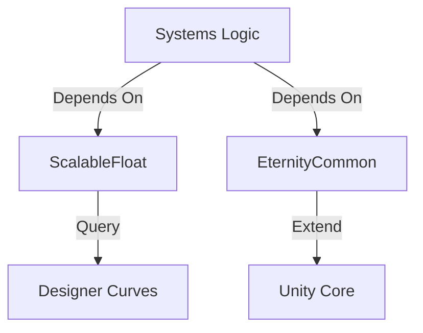

# Utilities Reference

This document provides a technical reference for the core utility libraries and mathematical systems that support the project's data-driven architecture.

## 📊 ScalableFloat (`ScalableFloat`)

The `ScalableFloat` system is a critical component for the project's balancing, allowing designers to define values that scale dynamically based on external variables (usually "Level").

### 1. The Value Logic
Instead of a static float, a `ScalableFloat` consists of:
- **Value**: The base magnitude.
- **Curve/Table Reference**: A pointer to a `CurveTable` or `AttributeCurve` that defines how the value changes.

### 2. Designer-Friendly Balancing
This allows a single "Attack" ability to have a static magnitude in code, while the actual damage scales from 10 to 500 across levels 1-50, all controlled via external Data Assets.

## 🛠️ EternityCommon (`EternityCommon`)

`EternityCommon` is the architectural bridge for cross-project code sharing, providing a set of standardized utilities and extensions.

### 1. Core Utilities
- **Singleton Pattern**: Standardized thread-safe implementation of the Singleton pattern for managers.
- **Extensions**: A library of C# extension methods for Unity (e.g., `Vector3` distance checks, `Transform` child finding, and `String` manipulation).
- **Attributes**: Custom property drawers and editor attributes to improve the Inspector experience.

## 🔄 Technical Stack

---
[Back to Overview](../Overview.md) | [Asset & Localization](./Asset_and_Localization.md)
