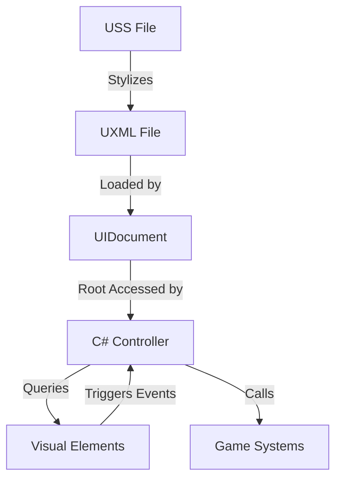

# UI Architecture

The project's user interface is built using **Unity UI Toolkit** (UXML/USS). It follows a variation of the Model-View-Controller (MVC) pattern to ensure a clean separation between layout, styling, and logic.

## 🧱 Layered Structure

### 1. The Layout (View - UXML)
Interfaces are defined in `.uxml` files using a hierarchical XML structure. 
- **Modular Templates**: Small, repeatable UI components (like inventory slots or settings rows) are saved as separate UXML files and instantiated via code.
- **UIDocument**: The scene-side component that anchors the UXML content into the game.

### 2. The Styling (Skin - USS)
All visual appearance (colors, borders, transitions, layout constraints) is managed through **Unity Style Sheets (.uss)**.
- **`AXL_Styles.uss`**: The project's global design system. It contains shared classes for "tactical" HUD elements like frames, brackets, and buttons.
- **Local Styles**: Specific UXML files may have accompanying USS files for unique layouts (e.g., `MainMenu.uss`).

### 3. The Controller (Logic - C#)
C# "Controllers" (e.g., `MainMenuController`, `SettingsUIController`) act as the glue between the layout and the game's data.
- **Entry Point**: `OnEnable()` is typically where the controller queries the `UIDocument` for visual elements.
- **Element Querying**: Uses the `.Q<T>("name")` selector pattern to find specific elements.
- **Event Binding**: Logic is bound using standard UI Toolkit events (e.g., `button.clicked += MyMethod;`).

## 🔄 UI Workflow

## 🛠️ Specialized UI Patterns

### Dynamic List Population
For systems like Inventory or Keybindings, the controllers follow this pattern:
1. Clear the container (e.g., a `ScrollView`).
2. Load a template UXML (e.g., `KeybindingRow.uxml`).
3. For each data item, instantiate the template (`visualTree.CloneTree()`).
4. Query the names/labels within that instance and set the data.
5. Add the instance to the container.

### AXL Design System
The "AXL" aesthetic is a core part of the architectural identity:
- **Neon Accents**: High-contrast cyan and amber colors.
- **Technical Readouts**: Labels use monospaced fonts or technical jargon (e.g., "SEC_ID", "STATUS_OK").
- **Motion**: Hover effects and transitions are defined in USS for performance and consistency.

---
[Back to Overview](../Overview.md) | [Ability System](../Systems/Ability_System.md) | [Networking Strategy](../Networking/Strategy.md)
